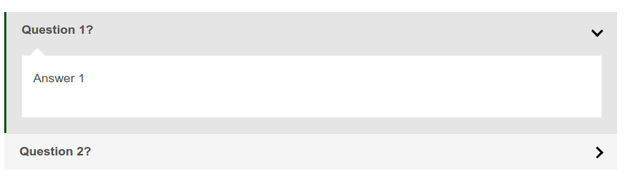

# Docsify Accordion

Plugin to use accordions in your docsify documentations.

## Implement stylesheet + javascript into your document:

```html
<link rel="stylesheet" href="//unpkg.com/docsify-accordion/src/style.css">
<script src="//unpkg.com/docsify-accordion/src/index.js"></script>
```

### Example FAQ Page

Starting your line with `+(space)` and ending with `(space)+` (spaces are important) will convert the list into an accordion

```md

# FAQ Section

Introduction text for the FAQ page.

+ Question 1? +

  Answer 1

+ Question 2? +

  Answer 2

```

It will look like this.



